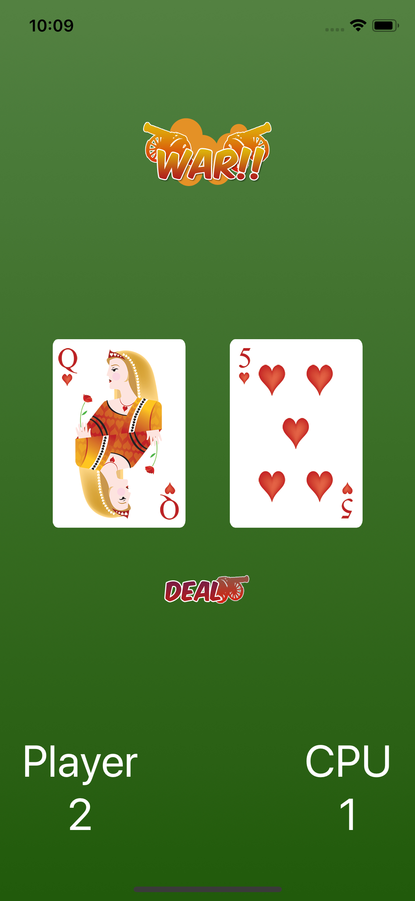

# War Game

A card game app that establishes the fundamentals of the Swift language.

## Created with

* Xcode 11
* Swift

## Key Takeaway's

* Stack views.

* Arrange objects on screen.

* Used comparison operators.

## Screenshot

## Learning Resources

* [Code with Chris](https://codewithchris.com/)

* Image assets provided by course.

## Acknowledgments

* iOS Community

